  

# Indentier

A silly formatter that hides `{`, `}`, `;`, and trailing `,` in the right margin — letting curly-brace languages pretend they're Python or Ruby.

Document: https://indentier.github.io/

